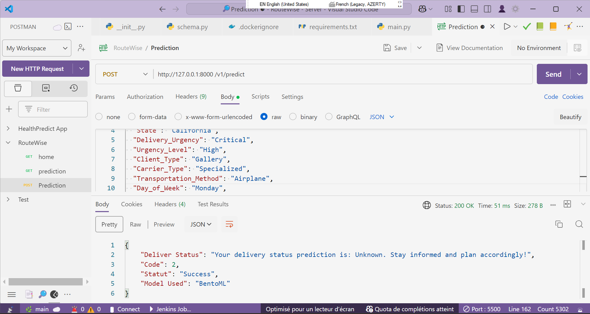
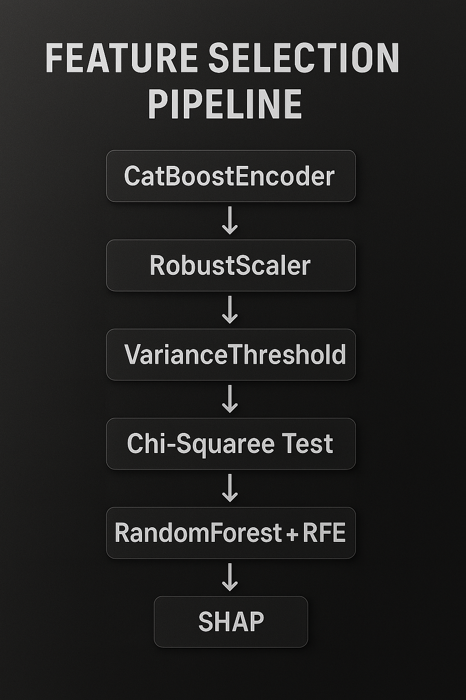
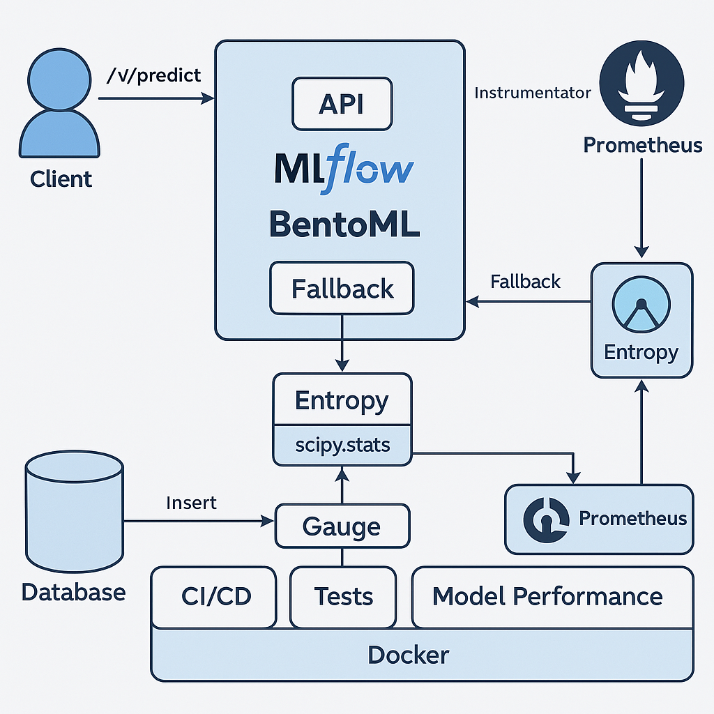
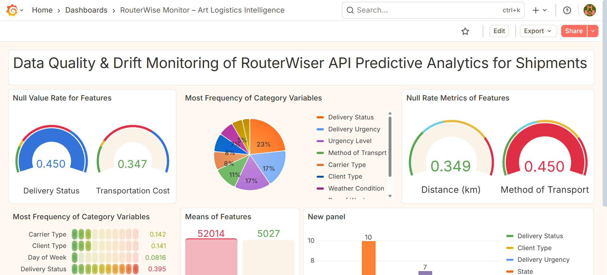
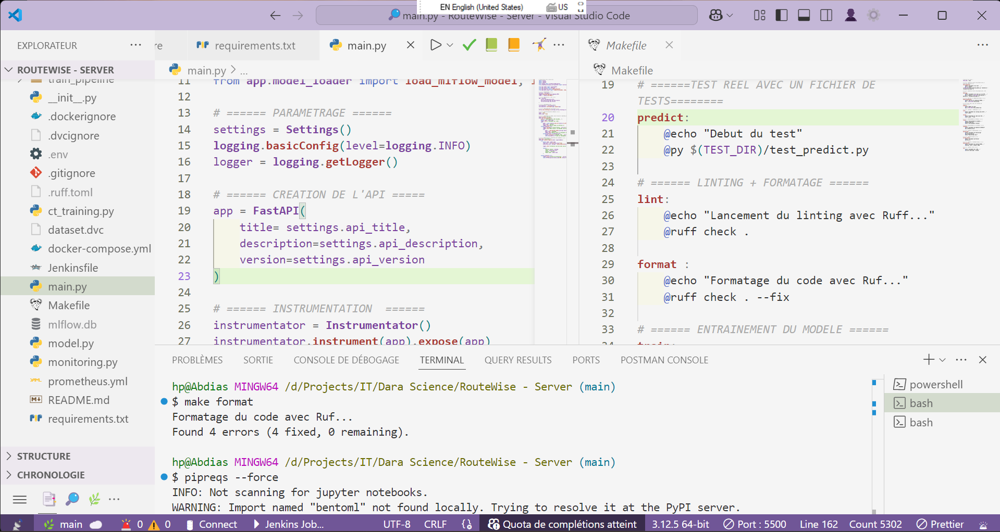

# 🎯 RouterWise — ML-Powered Logistics Optimization for Art Handling

RouterWise is a production-grade, modular MLOps pipeline built to optimize supply chains in the **sensitive and prestigious art logistics sector**. It is the intelligent backend of the upcoming `PrecisioArt` platform (Django-based), and delivers predictive insights and smart routing through a fully automated, monitored, and versioned ML lifecycle.

---

## 🧠 Project Purpose

Designed for high-value and highly constrained logistics workflows, this pipeline ensures:
- Predictive analytics for routing and optimization
- Clean, auditable MLOps with Continuous Training (CT)
- Modular, production-first codebase for scalability

---

---

## 🧰 Tech Stack

| Area                  | Tools & Frameworks                                               |
|-----------------------|------------------------------------------------------------------|
| Data Versioning       | DVC                                                              |
| Feature Selection     | CatBoostEncoder, RobustScaler, VarianceThreshold, Chi², RFE     |
| Modeling              | Scikit-learn, CatBoost, Pipelines                                |
| Experiment Tracking   | MLflow (local & remote registry)                                |
| Model Packaging       | BentoML                                                          |
| API Serving           | FastAPI (RouterWise module) integrated with PrecisioArt (Django)|
| CI/CD                 | Jenkins, Makefile                                                |
| Monitoring            | Prometheus + Grafana                                             |
| Testing               | Pytest                                                           |
| Containerization      | Docker, docker-compose                                           |
| Retraining            | `retrain/` (upcoming), Celery + Beat                            |


---
## 🏗️ Modular Project Architecture

```

routerwise/
│
├── app/                  # FastAPI app for serving predictions (BentoML runtime)
├── train\_pipeline/       # Feature engineering, training, inference, model saving
├── retrain/              # (WIP) Scheduled retraining logic with Celery + Beat
├── notebook/             # EDA and feature selection experiments
├── docker/               # Custom Dockerfiles
├── tests/                # Unit/integration test suites
├── Jenkinsfile           # CI/CD pipeline config
├── Makefile              # Unified entrypoint for all tasks
├── dataset.dvc           # DVC-tracked dataset pointer
└── README.md

````

---

## 🔁 MLOps Workflow

1. **Data versioning** using `DVC`
2. **Advanced feature engineering** with:
   - `CatBoostEncoder`, `RobustScaler`
   - `VarianceThreshold`, `Chi²`, `RandomForest`, `RFE`
3. **Training pipeline**:
   - Modular `sklearn` pipelines
   - Auto-logging to `MLflow`
4. **Model registration**:
   - Best model pushed to `MLflow Registry`
5. **Packaging and serving**:
   - Packaged using `BentoML`
   - Served via `FastAPI` (`app/`) — integrated with Django project `PrecisioArt`
6. **Monitoring & observability**:
   - Prometheus metrics collection
   - Grafana dashboards for API health, latency, drift, etc.
7. **Testing & validation**:
   - Unit and integration tests for both training and serving
8. **CI/CD**:
   - Automated with `Jenkinsfile`, lint/test/build/deploy


---

## 🔄 Continuous Training Strategy (Planned)

A `retrain/` module is planned for scheduled model updates using **Celery + Beat**.  
Key points:
- New data triggers a scheduled pipeline
- Retrained model is **compared** to the currently deployed one
- **Only if the new model outperforms** the current one will it be promoted
- Else, the system retains the existing model

---

## 📊 Monitoring Capabilities

Deployed metrics collected in real time:
- API latency, health, uptime (Prometheus)
- Request counts, error rates
- Drift detection on incoming data streams
- Data quality checks on inputs

Visualized via **Grafana dashboards**. **(CLICK ON THE IMAGE BELOW TO WATCH THE VIDEO)**

[](https://drive.google.com/file/d/1uD0oQKDrmADOqS0NHQR6PEfOGW2Jhqwu/view?usp=drive_link)

---

## ✅ CI/CD Pipeline

All components integrated into a production-grade `Jenkinsfile`:
- ✅ Unit tests
- ✅ Lint checks
- ✅ Build Docker image
- ✅ Trigger MLflow or BentoML packaging
- ✅ Optional deploy phase
- ✅ Slack/Webhook notifications (optional)

---

## ⚙️ Makefile Commands

```bash
make train       # Train and log with MLflow
make test        # Run test suite
make run         # Launch BentoML API server
make deploy      # Build + push containers
make monitoring  # Start Prometheus + Grafana stack
make format      # Run flake8 or ruff
````

---

## 🔒 Reproducibility & Integrity

* Reproducible pipelines with versioned datasets (`DVC`)
* Isolated & dockerized environments
* Centralized logging via `MLflow`
* Strict test coverage
* Modular architecture for easy refactor or integration

---

## 📍 Status

* ✅ Training pipeline complete
* ✅ Feature selection logic optimized
* ✅ API (RouterWise) deployed via BentoML
* ✅ Monitoring dashboards active
* 🔜 Continuous Training module (`retrain/`) in progress

---

## 🤝 Contribution

This is not a starter project, but an evolving production-grade pipeline.
If you're interested in contributing, please open a PR with clear module boundaries and test coverage.

---

## 🔗 About

Built by **Abdias Arsène**, IT Consultant in AI & MLOps
Focused on real-world, cross-industry ML solutions (Health, Humanitarian, Finance, Art Logistics)

> *“I don't write code to run. I write code to endure.”*

---


